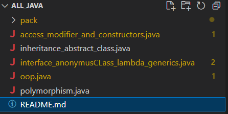

## Repo. With all **Java** basic concept in **_Program Form_**
\
> All The files are names for what they contain
>
> > NOTE : oop.java is just file to show **_Access Modifier in same package_**

\
### It Contains

- USE of Static Keyword
- Use of This , Super , Super()
- Constructors / and Constructor Chaining
- Getter / Setters
- Public / private / protected
- Package / and Importing Package
- Inheritance Child/Parent Class
- Abstract Method/Class
- Interfaces , Anonymus class , SubClass
- Lambda Expression Single_line/Multi_line
- Generics
- Polymorphism Static/Dynamic
- Exception Handeling / ( Throw/ Throws/ Try_catch )

## Snap Shot

